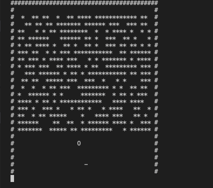

# AoC 2019 D13: Care Package

import { FrontMatter, Footer } from "../_components";

<FrontMatter frontMatter={frontMatter} />

## Part 1

For part 1, we just run to completion and pop all outputs:

```cpp
int block_count = 0;
std::vector<long long> outputs = prog.pop_all_output();
for (int i = 2; i < outputs.size(); i += 3) {
    long long tile_id = outputs[i];
    if (tile_id == 2) {
        block_count++;
    }
}
```

## Part 2

Now, building on [day 11](/notes/aoc/2019/11), the Intcode program is interactive but produces _many_ outputs at a time, so we cannot use a fixed number of `run_until_output()` calls. Instead, I added a `run_until_input()` method that runs until an input is needed, at which point we are certain that all outputs have been produced.

Initially, I thought about just playing the game myself, but it turned out to be a quite tedious process. [Reddit wisdom](https://www.reddit.com/r/adventofcode/comments/e9zgse/2019_day_13_solutions/) suggested two ways: (1) always move the paddle towards the ball, or (2) hack the memory to replace the paddle's row with walls. I implemented (1) since it felt more satisfying.

```cpp
while (true) {
    prog.run_until_input();
    int ball_pos;
    int paddle_pos;
    int score;
    std::vector<long long> outputs = prog.pop_all_output();
    // ...Process output
    if (prog.halted) {
        std::cout << score << std::endl;
        break;
    }
    if (ball_pos < paddle_pos) {
        input = -1;
    } else if (ball_pos > paddle_pos) {
        input = 1;
    } else {
        input = 0;
    }
    prog.send_input(input);
    prog.step();
}
```

I still kept my visualization logic though, and it was fun to watch the AI play the game:



(One complaint: I didn't understand from the problem statement that each time only the **diff** is output, so at first I rendered the entire screen each time and wondered why the blocks disappeared!)

<Footer frontMatter={frontMatter} />
