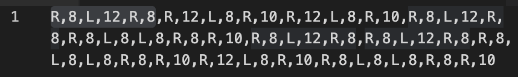

# AoC 2019 D17: Set and Forget

import { FrontMatter, Footer } from "../_components";

<FrontMatter frontMatter={frontMatter} />

This problem introduces string I/O, so I implemented two additional methods:

```cpp
void send_input(const std::string &str);
std::string pop_str_output();
```

Their implementations are straightforward extensions of the existing `send_input(long long)` and `pop_all_output()` methods.

## Part 1

Given the full output string, this problem is now as straightforward as any other AoC grid problem. I just iterate through each cell, and for each `#`, check if all four neighbors are also `#`.

## Part 2

The first step of part 2 is to simulate the robot's movement along the scaffolding by moving as far as possible in the current direction, then turning left or right when blocked, until we reach the end. After getting the movement sequence, the next step is to compress it into functions A, B, and C.

There's one simple trick here, for the purpose of submission: I can print out the movement sequence, paste it into VS Code, and select the longest substring that appears multiple times:



Of course, this isn't a general solution. To implement this logic in code, the idea is this:

1. We enumerate all prefixes of length up to 21 characters as function A. The prefix must end at a comma. (e.g., `R,8,L,12,R,8`)
2. We split the sequence by A into non-empty segments. (e.g., `["R,12,L,8,R,10,R,12,L,8,R,10,", "R,8,L,8,L,8,R,8,R,10,", "R,8,L,8,L,8,R,8,R,10,R,12,L,8,R,10,R,8,L,8,L,8,R,8,R,10,"]`)
3. For the first segment, we enumerate all prefixes of length up to 21 characters as function B. Again, the prefix must end at a comma. (e.g., `R,12,L,8,`)
4. We split all segments by B into non-empty segments. (e.g., `["R,10,", "R,10,", "R,8,L,8,L,8,R,8,R,10,", "R,8,L,8,L,8,R,8,R,10,", "R,10,R,8,L,8,L,8,R,8,R,10,"]`)
5. If all remaining segments are identical and of length up to 21 characters, these segments are function C.

C++ does not make this job easy for me, because it doesn't have convenient methods like `split()` or `replace()`, which I had to implement myself:

{/* cSpell:ignore delim npos */}

```cpp
std::vector<std::string> split(const std::vector<std::string> &data, const std::string &delim) {
    std::vector<std::string> result;
    for (const auto &line : data) {
        size_t start = 0;
        size_t end = line.find(delim);
        while (end != std::string::npos) {
            if (end != start) {
                result.push_back(line.substr(start, end - start));
            }
            start = end + delim.length();
            end = line.find(delim, start);
        }
        if (start >= line.length()) continue;
        result.push_back(line.substr(start, end));
    }
    return result;
}
```

After acquiring the functions A, B, and C, I can replace their occurrences in the movement sequence with `A,`, `B,`, and `C,` respectively, and finally send the main routine and functions to the program.

<Footer frontMatter={frontMatter} />
