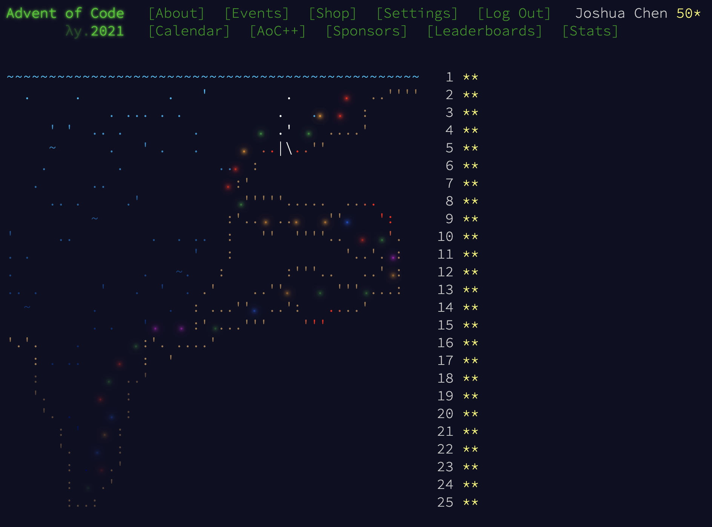

# Advent of Code 2021 notes

 | [Problem statements](https://adventofcode.com/2021) | [Source code](https://github.com/Josh-Cena/aoc2021)

<nav
  style={{ width: "100%", display: "flex", justifyContent: "space-between" }}>
  <a href="/notes/aoc/2020/">← Previous year</a>
  <a href="/notes/aoc/">Back to AoC index</a>
  <a href="/notes/aoc/2022/">→ Next year</a>
</nav>

<ul
  style={{
    display: "flex",
    gap: "0.5rem",
    flexWrap: "wrap",
    listStyle: "none",
    padding: 0,
  }}>
  {Array.from({ length: 25 }, (_, i) => i + 1).map((day) => (
    <li key={day} style={{ width: "1.5rem", textAlign: "center" }}>
      <a href={`/notes/aoc/2021/${day}`}>{day}</a>
    </li>
  ))}
</ul>

2021 was my first year doing AoC. By the end of 2021, I was invited to the [Docusaurus](https://docusaurus.io/) team and my TypeScript skills improved steadily since. It was virtually the _only_ language I programmed in, becoming the natural choice for 2021. However, for fear that the typings would slow me down where I don't need it, I actually stuck to untyped JS. But I also was naïve and didn't preserve my solutions, so I redid all of 2021 in TypeScript in 2025.

Despite familiarity, TypeScript was actually a poor choice for AoC because of its lack of built-in data structures including queues and hash maps. In particular the hash map issue was painful because I had to serialize all my keys into strings. Thank you to [datastructures-js](https://datastructures-js.info/) for providing priority queues, at least! I also didn't get to use most of the language features, except I forced generators and classes into [21](./21.mdx). Granted, I found its pointer chasing to be the most straightforward, without magical CoW behavior.

Difficulty-wise, the 2021 me got all the way to [19](./19.mdx) before bailing, so I think it was a very accessible year. Remarkably, there are not one, not two, but three problems that are bin-counting style DP: [6](./6.mdx), [14](./14.mdx), and [21](./21.mdx). I took some time thinking about [17](./17.mdx) because I was wholly occupied with a mathematical solution and didn't want to run much unnecessary code. 19 is challenging and tedious; [22](./22.mdx)'s algorithm is perhaps unfamiliar to some; [24](./24.mdx) is a very fun but also challenging in a non-coding way. [23](./23.mdx) is standard DP, which was out of my league in 2021 but very natural in 2025.

