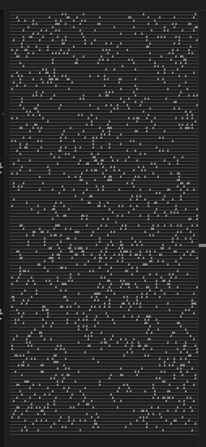

---
tags:
  - BFS/DFS
  - Puzzle
  - Manual inspection
  - Geometry
---

# Step Counter

## Part 1

Part 1 is a straightforward BFS, stopping when the distance is 64. However, since we can't do BFS for part 2, we might as well think about smarter solutions for part 1.

If we mark all cells that are reachable in exactly $t$ steps (allowing revisits), we see two patterns:

- They form a checkerboard pattern, with certain cells only reachable in odd steps and others only reachable in even steps. This is because if we first reach a cell at time $t$, then we can only return to it in even steps.
- The _farthest_ cells are bounded by a diamond shape with radius $t$. This is because the shortest path to a cell is the Manhattan distance.

Consider the example map. Here, I marked all cells reachable in exactly 5 steps and exactly 4 steps.

```js canvas width=340 height=340
const input = `...........
.....###.#.
.###.##..#.
..#.#...#..
....#.#....
.##..S####.
.##..#...#.
.......##..
.##.#.####.
.##..##.##.
...........`.split("\n");

ctx.strokeStyle = "#80808060";
for (let i = 0; i <= input.length; i++) {
  ctx.beginPath();
  ctx.moveTo(0, i * 30);
  ctx.lineTo(input[0].length * 30, i * 30);
  ctx.stroke();
}
for (let j = 0; j <= input[0].length; j++) {
  ctx.beginPath();
  ctx.moveTo(j * 30, 0);
  ctx.lineTo(j * 30, input.length * 30);
  ctx.stroke();
}

for (let i = 0; i < input.length; i++) {
  for (let j = 0; j < input[i].length; j++) {
    const cell = input[i][j];
    if (cell === "#") {
      ctx.fillStyle = colorMode === "dark" ? "#C0C0C0" : "#404040";
      ctx.fillRect(j * 30, i * 30, 30, 30);
    } else if (cell === "S") {
      ctx.fillStyle = "red";
      ctx.fillRect(j * 30, i * 30, 30, 30);
    }
  }
}

// prettier-ignore
const reachable5 = [[4, 5], [5, 4], [3, 4], [3, 6], [4, 7], [6, 3], [1, 4], [2, 7], [3, 8], [5, 8], [6, 7], [7, 4], [7, 2]];
// prettier-ignore
const reachable4 = [[4, 6], [5, 3], [3, 5], [3, 7], [5, 7], [7, 3]];
ctx.fillStyle = "#39CAC480";
reachable5.forEach(([i, j]) => {
  ctx.fillRect(i * 30, j * 30, 30, 30);
});
ctx.fillStyle = "#CA7D3980";
reachable4.forEach(([i, j]) => {
  ctx.fillRect(i * 30, j * 30, 30, 30);
});
ctx.lineWidth = 2;
ctx.strokeStyle = "#39CAC4";
ctx.beginPath();
ctx.moveTo(5.5 * 30, 0.5 * 30);
ctx.lineTo(10.5 * 30, 5.5 * 30);
ctx.lineTo(5.5 * 30, 10.5 * 30);
ctx.lineTo(0.5 * 30, 5.5 * 30);
ctx.closePath();
ctx.stroke();
ctx.strokeStyle = "#CA7D39";
ctx.beginPath();
ctx.moveTo(5.5 * 30, 1.5 * 30);
ctx.lineTo(9.5 * 30, 5.5 * 30);
ctx.lineTo(5.5 * 30, 9.5 * 30);
ctx.lineTo(1.5 * 30, 5.5 * 30);
ctx.closePath();
ctx.stroke();
```

Unfortunately, in this input, it is only guaranteed that $t\ge d$ where $d$ is the Manhattan distance and $t$ is the first time when we reach the cell. So we can't just count the number of cells in the diamond shape. But! In the real input, it happens that for all $t=64$ cells, $d=64$ as well. If we think about in what cases can $t > d$, it would be when we have to take a detour around an obstacle; more precisely:

- If the cell is on the same row or column as the start, then any rock between the start and the cell would force us to take a detour, so $t > d$:

  ```js canvas width=320 height=100
  ctx.fillStyle = "red";
  ctx.fillRect(0, 35, 30, 30);
  ctx.fillStyle = colorMode === "dark" ? "#C0C0C0" : "#404040";
  ctx.fillRect(135, 35, 30, 30);
  ctx.beginPath();
  ctx.moveTo(15, 50);
  ctx.lineTo(120, 50);
  ctx.lineTo(120, 20);
  ctx.lineTo(180, 20);
  ctx.lineTo(180, 50);
  ctx.lineTo(250, 50);
  ctx.stroke();
  ctx.fillStyle = textColor;
  ctx.beginPath();
  ctx.moveTo(250, 55);
  ctx.lineTo(250, 45);
  ctx.lineTo(260, 50);
  ctx.fill();
  ctx.textBaseline = "middle";
  ctx.font = "20px serif";
  ctx.fillText("t > d", 270, 50);
  ```

- If the cell is not on the same row or column as the start, then we can directly go to the cell in $d$ steps as long as either of its neighbors closer to the start is reachable in $d-1$ steps. More generally, a diagonal line of rocks creates a triangular region behind it that requires a detour:

  ```js canvas width=400 height=200
  ctx.fillStyle = "red";
  ctx.fillRect(0, 100, 30, 30);
  ctx.fillStyle = colorMode === "dark" ? "#C0C0C0" : "#404040";
  ctx.fillRect(90, 70, 30, 30);
  ctx.fillRect(60, 40, 30, 30);
  ctx.beginPath();
  ctx.moveTo(15, 115);
  ctx.lineTo(45, 115);
  ctx.lineTo(45, 25);
  ctx.lineTo(105, 25);
  ctx.lineTo(105, 55);
  ctx.moveTo(15, 115);
  ctx.lineTo(135, 115);
  ctx.lineTo(135, 55);
  ctx.lineTo(105, 55);
  ctx.stroke();
  ctx.fillStyle = textColor;
  ctx.beginPath();
  ctx.moveTo(100, 45);
  ctx.lineTo(110, 45);
  ctx.lineTo(105, 55);
  ctx.moveTo(115, 50);
  ctx.lineTo(115, 60);
  ctx.lineTo(105, 55);
  ctx.fill();
  ctx.textBaseline = "middle";
  ctx.font = "20px serif";
  ctx.fillText("t > d", 120, 50);
  ctx.fillStyle = "red";
  ctx.fillRect(200, 100, 30, 30);
  ctx.fillStyle = colorMode === "dark" ? "#C0C0C0" : "#404040";
  ctx.fillRect(290, 70, 30, 30);
  ctx.fillStyle = textColor;
  ctx.beginPath();
  ctx.moveTo(215, 115);
  ctx.lineTo(275, 115);
  ctx.lineTo(275, 55);
  ctx.lineTo(305, 55);
  ctx.stroke();
  ctx.beginPath();
  ctx.moveTo(295, 50);
  ctx.lineTo(295, 60);
  ctx.lineTo(305, 55);
  ctx.fill();
  ctx.textAlign = "center";
  ctx.fillText("t = d", 300, 40);
  ```

  ```js canvas width=200 height=200
  ctx.fillStyle = "red";
  ctx.fillRect(7.5, 147.5, 5, 5);
  ctx.lineWidth = 2;
  ctx.beginPath();
  ctx.moveTo(20, 20);
  ctx.lineTo(120, 120);
  ctx.stroke();
  ctx.fillStyle = colorMode === "dark" ? "#C0C0C040" : "#40404040";
  ctx.beginPath();
  ctx.moveTo(20, 20);
  ctx.lineTo(120, 20);
  ctx.lineTo(120, 120);
  ctx.fill();
  ctx.lineWidth = 1;
  ctx.beginPath();
  ctx.moveTo(10, 150);
  ctx.lineTo(10, 15);
  ctx.lineTo(100, 15);
  ctx.stroke();
  ctx.fillStyle = textColor;
  ctx.beginPath();
  ctx.moveTo(100, 15);
  ctx.lineTo(90, 10);
  ctx.lineTo(90, 20);
  ctx.fill();
  ```

For the real input, no rocks are placed on the same row or column as the start, and very few rocks are placed diagonally. Furthermore, there's a diamond-shaped all empty region inscribed by the map, in which absolutely no rocks exist, which acts as buffer room allowing any detours to be "smoothed out":



Anyway, the conclusion is that whenever a cell is inside the diamond with radius 64, it is reachable in 64 steps, no exceptions. It is reachable in _exactly_ 64 steps with the additional condition that it's an even cell (i.e., its Manhattan distance from the start is even).

```R
dist <- abs(row(mat) - start[1]) + abs(col(mat) - start[2])
reachable <- bfs(mat, start)
res <- sum(reachable & (dist <= 64) & (dist %% 2 == 0))
```

In fact, had the map be _slightly_ nicer, we might actually be able to replace the `bfs` entirely with `mat != "#"`. The only reason we need to do BFS is that some cells are entirely surrounded by rocks and thus unreachable.

## Part 2

If there was any doubt in part 1, part 2 confirms that brute-force BFS can't work and we must look for patterns. We now bump up the problem one scale, so instead of a grid of discrete cells, we consider a grid of _matrices_, each one with the same shape as the original map.

First, the parity condition still holds: there are cells that are only reachable in odd steps and cells that are only reachable in even steps. Because the matrix width and height are both 131, an odd number, the parity of the same cell alternates between odd and even as we move from one matrix to the next. For example, if $(x, y)$ is an odd cell, then when we move to the matrix to its right, $(x + 131, y)$ is an even cell. This means that _matrices_ also have parity, measured by the Manhattan distance in matrices from the starting matrix to it, and the real parity of a cell is the parity of the matrix plus the parity of the cell within the starting matrix. The starting matrix is even because it has 0 distance from itself.

Now let's consider a diamond with radius 26501365, overlaid on this grid of matrices (remember that the diamond cuts through the diagonal of matrix cells like in part 1, but because we have zoomed out here, it appears as if the points are continuous).

```js canvas width=370 height=370
const boardSize = 9;
for (let i = 0; i < boardSize; i++) {
  for (let j = 0; j < boardSize; j++) {
    ctx.fillStyle = (i + j) % 2 === 0 ? "#CA7D3980" : "#39CAC480";
    ctx.fillRect(j * 40, i * 40, 40, 40);
  }
}
ctx.strokeStyle = "#80808060";
for (let i = 0; i <= boardSize; i++) {
  ctx.beginPath();
  ctx.moveTo(0, i * 40);
  ctx.lineTo(boardSize * 40, i * 40);
  ctx.stroke();
}
for (let j = 0; j <= boardSize; j++) {
  ctx.beginPath();
  ctx.moveTo(j * 40, 0);
  ctx.lineTo(j * 40, boardSize * 40);
  ctx.stroke();
}
ctx.fillStyle = "red";
ctx.fillRect(178, 178, 4, 4);
ctx.lineWidth = 2;
ctx.strokeStyle = textColor;
ctx.beginPath();
ctx.moveTo(180, 180 - 180);
ctx.lineTo(180 + 180, 180);
ctx.lineTo(180, 180 + 180);
ctx.lineTo(180 - 180, 180);
ctx.closePath();
ctx.stroke();
```

The number `26501365` is no accident: $26501365 = 65 + 131\times 202300$, meaning that we can first travel to the border of the starting matrix in 65 steps, and then travel 202300 (an even number) matrices. So the above diagram is accurate in that eventually the corner of the diamond should touch the edge of an orange (even) matrix. Now we need to count the number of odd cells in this diamond, which requires counting 4 things:

- The number of more than half-covered odd matrices (the cyan ones), and the number of even cells (as defined in the starting matrix) in each one.
- The number of more than half-covered even matrices (the orange ones), and the number of odd cells (as defined in the starting matrix) in each one.
- Add the even cells from the little cyan triangles on the inside of the diamond's border.
- Subtract the odd cells from the little orange triangles on the outside of the diamond's border.

Calculation of numbers of even and odd cells in a whole matrix is the same as before:

```R
dist <- abs(row(mat) - start[1]) + abs(col(mat) - start[2])
is_even <- dist %% 2 == 0
reachable <- bfs(mat, start)
even_cells_in_mat <- as.bigz(sum(is_even & reachable))
odd_cells_in_mat <- as.bigz(sum(!is_even & reachable))
```

In the diagram above, the diamond has a radius of 4 matrices, and includes 25 orange matrices and 16 cyan matrices (you can see this more clearly if you turn your head 45 degrees, and you can see that the orange matrices and cyan matrices form two lattices). Therefore, with $R=202300$, we have $(R+1)^2$ orange (even) matrices and $R^2$ cyan (odd) matrices.

The next step is to add the cyan triangles and subtract the orange triangles. Let's zoom in to see what one of them looks like. Remember that here each cell is an actual cell, not a matrix, although the colors still mark matrix parity. I've highlighted the cyan cells that need to be included and orange cells that need to be excluded.

```js canvas width=300 height=300
for (let i = 0; i < 2; i++) {
  for (let j = 0; j < 2; j++) {
    ctx.fillStyle = (i + j) % 2 !== 0 ? "#CA7D3980" : "#39CAC480";
    ctx.fillRect(j * 135, i * 135, 135, 135);
  }
}
ctx.strokeStyle = "#80808060";
for (let i = 0; i <= 18; i++) {
  ctx.beginPath();
  ctx.moveTo(0, i * 15);
  ctx.lineTo(18 * 15, i * 15);
  ctx.stroke();
}
for (let j = 0; j <= 18; j++) {
  ctx.beginPath();
  ctx.moveTo(j * 15, 0);
  ctx.lineTo(j * 15, 18 * 15);
  ctx.stroke();
}
ctx.fillStyle = "#CA7D39";
// prettier-ignore
for (const cell of [
  [9, 0], [10, 0], [11, 0], [12, 0], [9, 1], [10, 1], [11, 1], [9, 2], [10, 2], [9, 3],
  [0, 9], [1, 9], [2, 9], [3, 9], [0, 10], [1, 10], [2, 10], [0, 11], [1, 11], [0, 12],
  [0, 14], [0, 15], [1, 15], [0, 16], [1, 16], [2, 16], [0, 17], [1, 17], [2, 17], [3, 17],
]) {
  ctx.fillRect(cell[0] * 15, cell[1] * 15, 15, 15);
}
ctx.fillStyle = "#39CAC4";
// prettier-ignore
for (const cell of [
  [8, 6], [8, 7], [8, 8], [7, 7], [7, 8], [6, 8]
]) {
  ctx.fillRect(cell[0] * 15, cell[1] * 15, 15, 15);
}
ctx.strokeStyle = textColor;
ctx.lineWidth = 2;
ctx.beginPath();
ctx.moveTo(75, 270);
ctx.lineTo(7.5, 135 * 1.5);
ctx.lineTo(210, 0);
ctx.stroke();
```

If we look at the diamond as a whole, we notice that if the diamond has radius $R$ (again measured in matrices), then there are $R+1$ orange triangles for each of upper-left, upper-right, lower-left, and lower-right, as well as $R$ cyan triangles for each of these four corners. If we pack these corners into the same matrix, and then only take the even cells from the cyan triangles and odd cells from the orange triangles, it looks like this:

```js canvas width=350 height=170
ctx.strokeStyle = "#80808060";
for (let i = 0; i <= 9; i++) {
  ctx.beginPath();
  ctx.moveTo(0, i * 15);
  ctx.lineTo(9 * 15, i * 15);
  ctx.stroke();
}
for (let j = 0; j <= 9; j++) {
  ctx.beginPath();
  ctx.moveTo(j * 15, 0);
  ctx.lineTo(j * 15, 9 * 15);
  ctx.stroke();
}
for (let i = 0; i <= 9; i++) {
  ctx.beginPath();
  ctx.moveTo(200, i * 15);
  ctx.lineTo(9 * 15 + 200, i * 15);
  ctx.stroke();
}
for (let j = 0; j <= 9; j++) {
  ctx.beginPath();
  ctx.moveTo(j * 15 + 200, 0);
  ctx.lineTo(j * 15 + 200, 9 * 15);
  ctx.stroke();
}
ctx.font = "20px serif";
ctx.textAlign = "center";
ctx.textBaseline = "middle";
ctx.fillText("×(R+1)", 15 * 4.5, 150);
ctx.fillText("×R", 15 * 4.5 + 200, 150);
ctx.fillStyle = "#CA7D39";
// prettier-ignore
for (const cell of [
  [0, 0], [1, 0], [2, 0], [3, 0], [0, 1], [1, 1], [2, 1], [0, 2], [1, 2], [0, 3],
  [0, 5], [0, 6], [1, 6], [0, 7], [1, 7], [2, 7], [0, 8], [1, 8], [2, 8], [3, 8],
  [5, 0], [6, 0], [7, 0], [8, 0], [6, 1], [7, 1], [8, 1], [7, 2], [8, 2], [8, 3],
  [8, 5], [7, 6], [8, 6], [6, 7], [7, 7], [8, 7], [5, 8], [6, 8], [7, 8], [8, 8],
]) {
  if ((cell[0] + cell[1]) % 2 !== 0) {
    ctx.fillRect(cell[0] * 15, cell[1] * 15, 15, 15);
  }
}
ctx.fillStyle = "#39CAC4";
// prettier-ignore
for (const cell of [
  [0, 0], [1, 0], [2, 0], [0, 1], [1, 1], [0, 2],
  [0, 6], [0, 7], [1, 7], [0, 8], [1, 8], [2, 8],
  [6, 0], [7, 0], [8, 0], [7, 1], [8, 1], [8, 2],
  [8, 6], [7, 7], [8, 7], [6, 8], [7, 8], [8, 8],
]) {
  if ((cell[0] + cell[1]) % 2 === 0) {
    ctx.fillRect(cell[0] * 15 + 200, cell[1] * 15, 15, 15);
  }
}
```

The union of the orange and cyan triangles is exactly the corners that are outside a diamond inscribed in the matrix (remember that R is 1-indexed; if this is 0-indexed then the condition should be `dist > start[0]` instead):

```R
is_corner <- dist >= start[1]
```

Now we can count the cyan cells (even cells in these corners) and orange cells (odd cells in these corners):

```R
even_corners_in_mat <- as.bigz(sum(is_corner & is_even & reachable))
odd_corners_in_mat <- as.bigz(sum(is_corner & !is_even & reachable))
```

Finally, we can put these together:

```R
mat_radius <- as.bigz((26501365 - (w - 1) / 2) / w)
total <- odd_cells_in_mat *
  (mat_radius + 1)^2 +
  even_cells_in_mat * mat_radius^2 +
  even_corners_in_mat * mat_radius -
  odd_corners_in_mat * (mat_radius + 1)
```
