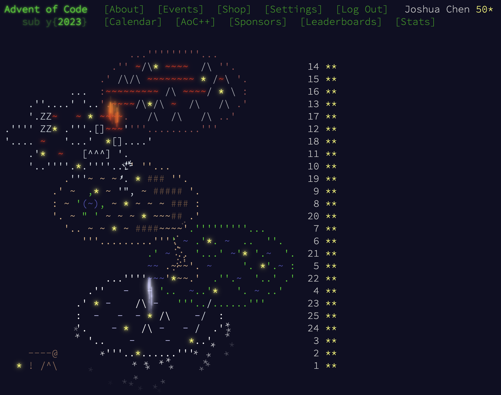

# Advent of Code 2023 notes

 | [Problem statements](https://adventofcode.com/2023) | [Source code](https://github.com/Josh-Cena/aoc2023)

<nav
  style={{ width: "100%", display: "flex", justifyContent: "space-between" }}>
  <a href="/notes/aoc/2022/">← Previous year</a>
  <a href="/notes/aoc/">Back to AoC index</a>
  <a href="/notes/aoc/2024/">→ Next year</a>
</nav>

<ul
  style={{
    display: "flex",
    gap: "0.5rem",
    flexWrap: "wrap",
    listStyle: "none",
    padding: 0,
  }}>
  {Array.from({ length: 25 }, (_, i) => i + 1).map((day) => (
    <li key={day} style={{ width: "1.5rem", textAlign: "center" }}>
      <a href={`/notes/aoc/2023/${day}`}>{day}</a>
    </li>
  ))}
</ul>

2023 was supposedly my third year doing AoC, but I actually did it retrospectively in 2025. I was just appointed leader of [CourseTable](https://coursetable.com/) and I was grinding on it every day. When I chose a language for 2023 in retrospect, I actually had several candidates. First, I started learning Rust in early 2022, but I already happened to do [2025](../2025/index.mdx) with it; second, I learned Racket in late 2022 because my friends were all taking an [intro CS](https://coursetable.com/worksheet?course-modal=202203-10948) class, but I don't consider myself proficient enough (I might still revisit it in a future year); third, I learned R in early 2023 in a [data analysis an exploration](https://coursetable.com/worksheet?course-modal=202301-20528) class. Since then, in late 2023, I took another [probability class](https://coursetable.com/worksheet?course-modal=202303-18256) where I was intimidated by assignments using R, so overall it seemed like a year of R. If not now, when?

R was _the most awkward_ language I've ever touched. You can call it powerful and expressive et cetera, but for writing plain old algorithms, it's just a hot mess. Here are the things I've complained about this year:

- No built-in hash maps or sets. String keys into lists are secretly linear under the hood. Even when you use hacks like `new.env()` you still have to serialize complex keys into strings.
- Terrible typing, which is to say none. Meanwhile all the variable types are crazy complex with vectorization, `sapply`/`lapply` and stuff. I have to constantly paste into ChatGPT "what's the type of this variable and how do I index into it".
- No Int64, like at all?? I had to load [gmp](https://cran.r-project.org/web/packages/gmp/index.html) to use int64 (of which there were a lot that year!).
- 1-indexing. This is not a problem in itself but it makes translating algorithms a bit harder, especially ones where the list indices are intended as keys rather than arbitrary positions.
- Secret CoW. Hidden performance costs and subtle bugs everywhere. I always have to deep-modify like `a[[i]][[j]][k] <- foo` without saving any intermediate variables.
- And of course, performance was slow in general.
- Compared to all of the above, problems like "no priority queues" and "no queues" seem such trivial problems especially since they are solved by the [collections](https://cran.r-project.org/web/packages/collections/index.html) package.

On the upside, [igraph](https://cran.r-project.org/web/packages/igraph/index.html) was very helpful for graph problems like [20](./20.mdx), [23](./23.mdx), and [25](./25.mdx), and I did benefit from vectorization and data frame operations in many problems.

I enjoyed the "theme" this year, since I can clearly see the path we moved through: the different islands, up and down. I don't know if it's a "when you have a hammer" situation, but I find more math problems this year than average, as pure as [9](./9.mdx). There were even [two](./10.mdx) [problems](./18.mdx) involving the shoelace formula! Also more graphs and mazes than DP—which I appreciate because again it's not easy to memoize in R.

Difficulty-wise, I think the difficulty is yet higher than 2022. Language problems aside, [5](./5.mdx) actually gave me a hard time because I had to wrap my head around how the mappings compose. [8](./8.mdx) was tricky as well, especially because it isn't obvious that the naïve solution should work and it's so apparently wrong in most cases. Then it went pretty smoothly until [20](./20.mdx) where I spent a lot of time doing it generically before seeing that the circuit has structure. [21](./21.mdx) is I'd consider the hardest problem of the year, and again the input is specially constructed so it's unnecessary to write a fully generic solution. [23](./23.mdx) is also theoretically sophisticated. It's possible to get away with naïve DFS, but I spent a good amount of time optimizing it, particularly because R is so slow already. These monsters make [24](./24.mdx) and [25](./25.mdx) look like babies (especially when I can cheat with `igraph` for 25)!

