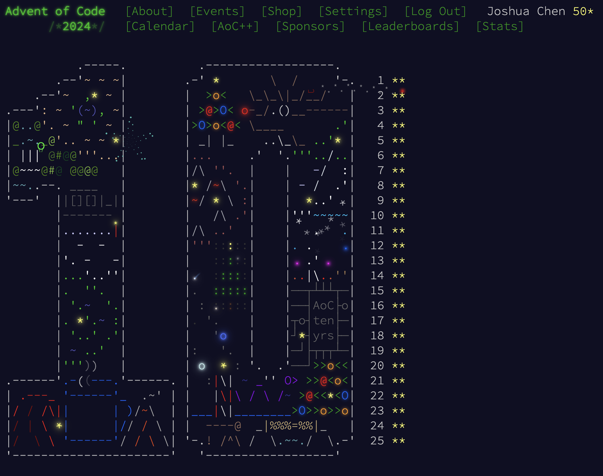

# Advent of Code 2024 notes

import { YearHeader } from "../_components";

<YearHeader year={2024} />

2024 was supposedly my fourth year doing AoC, but I actually did it retrospectively in 2025. I was completely occupied with final season and schoolwork in December. The spring of 2024, I took the infamous [systems programming](https://coursetable.com/catalog?course-modal=202401-28082) class where I practiced Rust. Then in fall, I took a [compilers](https://coursetable.com/catalog?course-modal=202403-10132) class entirely in OCaml and a [software analysis and verification](https://coursetable.com/catalog?course-modal=202403-10141) class that was half-Haskell half-Rust. Later in spring 2025, I took a [formal semantics](https://coursetable.com/catalog?course-modal=202501-22580) class in Rocq. My prowess with programming languages grew significantly, and I decided to try out the new hammer in my toolbox: OCaml.

I thought OCaml would be as elegant and enjoyable as Haskell, but it turned out to be on the other side of the spectrum. I pretty much lamented everything that Haskell has but OCaml lacks, and equally detested everything that OCaml exclusively has. For example, I can't resist using `while`, arrays, and loops because they make my brain feel at ease, which I had to later refactor into recursion. On the other hand, I really missed Haskell's powerful abstractions—what's an FP language without function composition, lazy evaluation, and immutable collections? OCaml's standard library is also extremely bare-bones, especially compared to Haskell's. It doesn't even have a polymorphic print function.

I enjoyed this year's tributes to past years' themes, although I only have experience with half of them. I did expect more connection in the actual _puzzle_ though, like same input format or similar algorithms, but looks like the connection is only present in the first paragraph or two.

Difficulty-wise, I think 2024 is tuned down from 2022 and 2023. Everything was pretty frictionless until [14](./14.mdx), whose part 2 I had to search on Reddit for hints. [17](./17.mdx) took a good amount of my time, but I enjoyed these VM problems as always. I would consider [18](./18.mdx) demanding some thought (I messed up part 2 initially with node allocation, which I had to debug for a while). [21](./21.mdx) is _by far_ the hardest problem of the year, and perhaps even the hardest of all times. I was traveling when doing this, and I spent a night and a train ride solving it. [23](./23.mdx) is only hard because I can't cheat with `igraph` or `networkx` (which I would have done if I chose R or Python). [24](./24.mdx) wasn't particularly _hard_ (if one knows the structure of an adder) but very tedious to code up. My initial solution was more of a "computer-_assisted_ solution" since it stops every time a swap is continued, and only restarts when the swap is hard-coded in the source code. My revised algorithm gets rid of this, but it still relies on mercy of the input.

