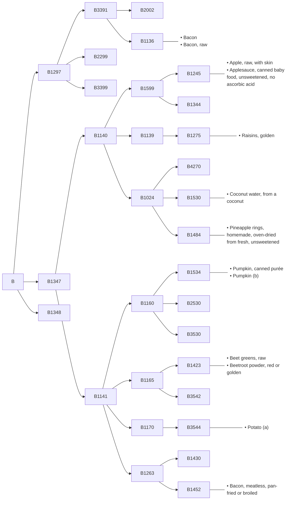
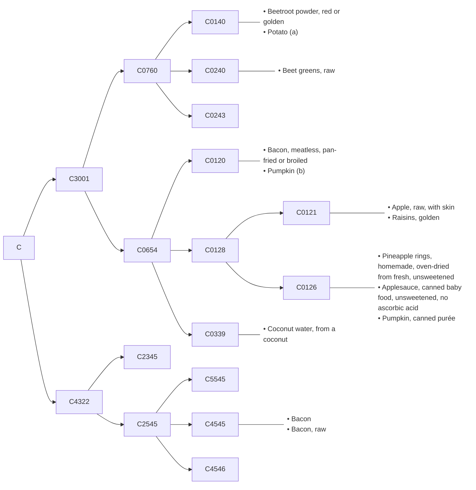
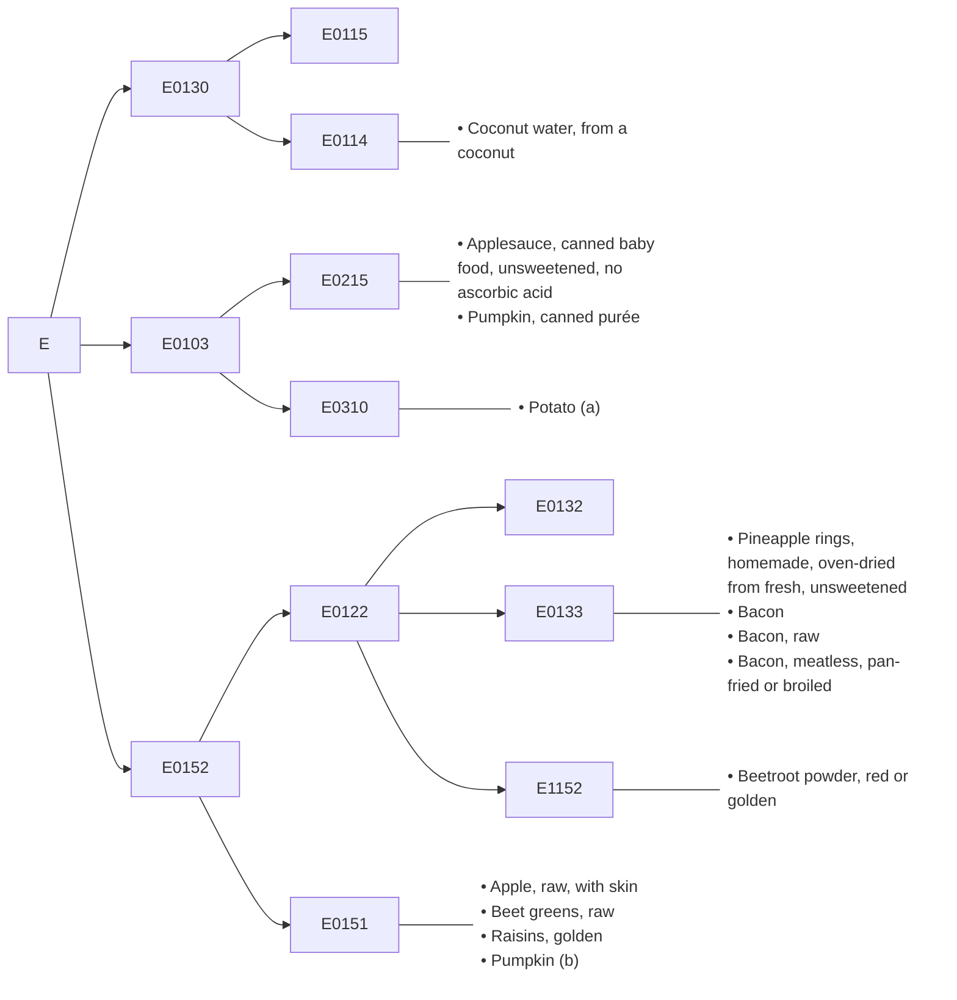
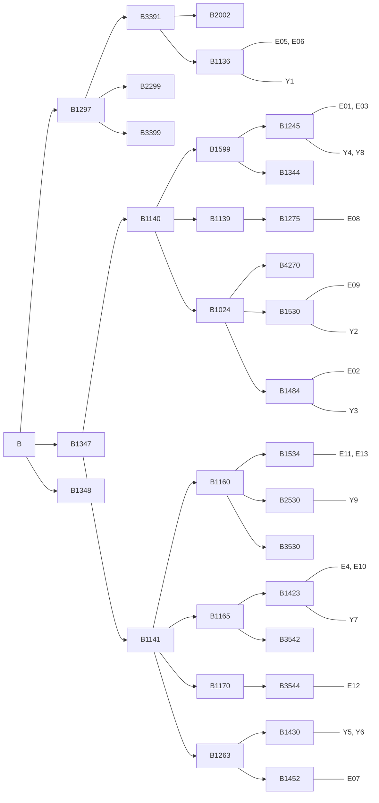
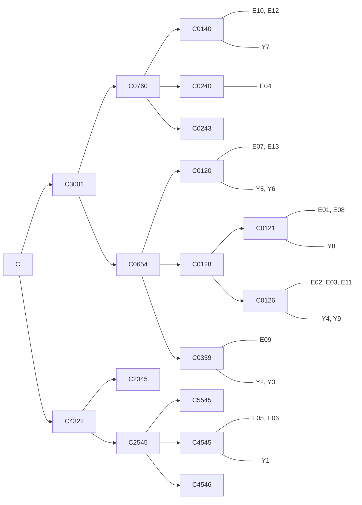
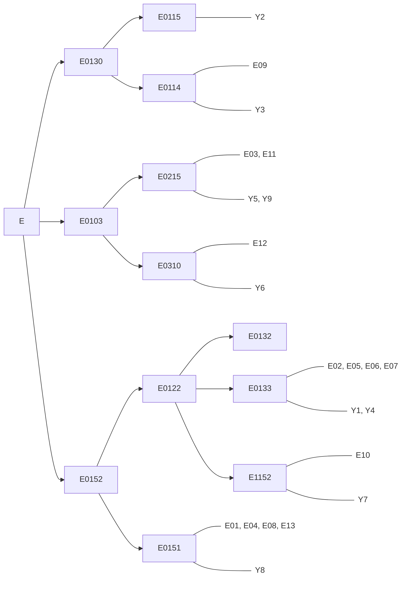

---
tags:
  - Computational
  - Semantics
---

# Yumology

{/* cSpell:ignore Yumology */}

Let's make sure we know what's happening. We have 5 facets, and a classification tree. Each facet corresponds to one leave node in the tree. We are supposed to find commonalities between the facets, and use those to construct intermediate classifications.

{/* prettier-ignore */}
{/* <table>

  <tbody>
    <tr><td rowSpan={4}>B1297</td><td rowSpan={2}>B3391</td><td colSpan={2}>B2002</td></tr>
    <tr>    <td colSpan={2}>B1136</td><td>Bacon Bacon, raw</td></tr>
    <tr>  <td colSpan={3}>B2299</td></tr>
    <tr>  <td colSpan={3}>B3399</td></tr>
    <tr><td rowSpan={14}>B1347</td><td rowSpan={6}>B1140</td><td rowSpan={2}>B1599</td><td>B1245</td><td>Apple, raw, with skin Applesauce, canned baby food, unsweetened, no ascorbic acid</td></tr>
    <tr>      <td>B1344</td></tr>
    <tr>    <td>B1139</td><td>B1275</td><td>Raisins, golden</td></tr>
    <tr>    <td rowSpan={3}>B1024</td><td>B4270</td></tr>
    <tr>      <td>B1530</td><td>Coconut water, from a coconut</td></tr>
    <tr>      <td>B1484</td><td>Pineapple rings, homemade, oven-dried from fresh, unsweetened</td></tr>
    <tr>  <td rowSpan={8}>B1141</td><td rowSpan={3}>B1160</td><td>B1534</td><td>Pumpkin, canned purée Pumpkin (b)</td></tr>
    <tr>      <td>B2530</td></tr>
    <tr>      <td>B3530</td></tr>
    <tr>    <td rowSpan={2}>B1165</td><td>B1423</td><td>Beet greens, raw Beetroot powder, red or golden</td></tr>
    <tr>      <td>B3542</td></tr>
    <tr>    <td>B1170</td><td>B3544</td><td>Potato (a)</td></tr>
    <tr>    <td rowSpan={2}>B1263</td><td>B1430</td></tr>
    <tr>      <td>B1452</td><td>Bacon, meatless, pan-fried or broiled</td></tr>
    <tr><td colSpan={4}>B1348</td></tr>
  </tbody>
</table> */}

So the B facets obviously correspond to the material (origin?) of the food. "Bacon, meatless" is far from the other "bacon" because it's still plant-based and therefore doesn't go into the "meat" half. We already know that (a) and (b) are potato and pumpkin respectively, so this categorization doesn't tell us much.

{/* prettier-ignore */}
{/* <table>

  <tbody>
    <tr><td rowSpan={7}>C3001</td><td rowSpan={3}>C0760</td><td colSpan={2}>C0140</td><td>Beetroot powder, red or golden Potato (a)</td></tr>
    <tr>    <td colSpan={2}>C0240</td><td>Beet greens, raw</td></tr>
    <tr>    <td colSpan={2}>C0243</td></tr>
    <tr>  <td rowSpan={4}>C0654</td><td colSpan={2}>C0120</td><td>Bacon, meatless, pan-fried or broiled Pumpkin (b)</td></tr>
    <tr>    <td rowSpan={2}>C0128</td><td>C0121</td><td>Apple, raw, with skin Raisins, golden</td></tr>
    <tr>      <td>C0126</td><td>Pineapple rings, homemade, oven-dried from fresh, unsweetened Applesauce, canned baby food, unsweetened, no ascorbic acid Pumpkin, canned purée</td></tr>
    <tr>    <td colSpan={2}>C0339</td><td>Coconut water, from a coconut</td></tr>
    <tr><td rowSpan={4}>C4322</td><td colSpan={3}>C2345</td></tr>
    <tr>  <td rowSpan={3}>C2545</td><td colSpan={2}>C5545</td></tr>
    <tr>    <td colSpan={2}>C4545</td><td>Bacon Bacon, raw</td></tr>
    <tr>    <td colSpan={2}>C4546</td></tr>
  </tbody>
</table> */}

The C facets still separates the two "bacon" items far from everything else. It puts beetroot, potato, and beet greens in one group, while pumpkin, apple, raisin, pineapple, and coconut in the other—this is separation based on the part of the plant that's eaten (root vs. leaf vs. fruit). Since "potato" is already made from the same part as "beetroot" (both root), we don't know anything extra about (a). On the other hand, this "pumpkin (b)" should be made from the same part as "bacon, meatless", which is "extracted from beans, nuts, grains, etc." So we also want something from pumpkin seeds.

{/* prettier-ignore */}
{/* <table>

  <tbody>
    <tr><td rowSpan={2}>E0130</td><td colSpan={2}>E0115</td></tr>
    <tr>  <td colSpan={2}>E0114</td><td>Coconut water, from a coconut</td></tr>
    <tr><td rowSpan={2}>E0103</td><td colSpan={2}>E0215</td><td>Applesauce, canned baby food, unsweetened, no ascorbic acid Pumpkin, canned purée</td></tr>
    <tr>  <td colSpan={2}>E0310</td><td>Potato (a)</td></tr>
    <tr><td rowSpan={4}>E0152</td><td rowSpan={3}>E0122</td><td>E0132</td></tr>
    <tr>    <td>E0133</td><td>Pineapple rings, homemade, oven-dried from fresh, unsweetened Bacon Bacon, raw Bacon, meatless, pan-fried or broiled</td></tr>
    <tr>    <td>E1152</td><td>Beetroot powder, red or golden</td></tr>
    <tr>  <td colSpan={2}>E0151</td><td>Apple, raw, with skin Beet greens, raw Raisins, golden Pumpkin (b)</td></tr>
  </tbody>
</table> */}

The E facets have three major groups, containing coconut water in one, applesauce in the second, and everything else in the third. This is based on the liquidity of the food. So "Potato (a)" should be close in liquidity to applesauce and pumpkin purée—i.e., mushy, while "Pumpkin (b)" is solid like apple and raisins.

<table>
  {/* prettier-ignore */}
  <tbody>
    <tr><td>F0013</td><td>Pineapple rings, homemade, oven-dried from fresh, unsweetened Applesauce, canned baby food, unsweetened, no ascorbic acid Bacon, meatless, pan-fried or broiled Pumpkin, canned purée Potato (a) Pumpkin (b)</td></tr>
    <tr><td>F0001</td><td>Bacon Raisins, golden Beetroot powder, red or golden</td></tr>
    <tr><td>F0003</td><td>Apple, raw, with skin Beet greens, raw Bacon, raw Coconut water, from a coconut</td></tr>
  </tbody>
</table>

Everything in the first F facet is processed (mostly cooking, but also canning), while everything in the third facet is explicitly raw. The second facet may or may not be processed.

<table>
  {/* prettier-ignore */}
  <tbody>
    <tr><td>A2001</td><td>Pineapple rings, homemade, oven-dried from fresh, unsweetened Raisins, golden Beetroot powder, red or golden</td></tr>
    <tr><td>A2002</td><td>Pumpkin (b)</td></tr>
    <tr><td>A2003</td><td>Apple, raw, with skin Applesauce, canned baby food, unsweetened, no ascorbic acid Beet greens, raw Bacon Bacon, raw Bacon, meatless, pan-fried or broiled Coconut water, from a coconut Pumpkin, canned purée Potato (a)</td></tr>
  </tbody>
</table>

Everything in the first A facet is dried. Everything in the third facet is not dried. The second facet is just "Pumpkin (b)", so it has to be ambiguous.

In conclusion, here's what we know about the two blanks:

- Potato (a): root, mushy, processed, not dried
- Pumpkin (b): seed, solid, processed, ambiguous in terms of drying

So (a) could be "mashed" while (b) could be "seeds, roasted".

Now for P2, we need to first understand how the estimated K values are calculated, especially in the case of non-matching facets. Here they are again, with the YUM FDC ones marked in as well:

{/* prettier-ignore */}
{/* <table>

  <tbody>
    <tr><td rowSpan={4}>B1297</td><td rowSpan={2}>B3391</td><td colSpan={2}>B2002</td></tr>
    <tr>    <td colSpan={2}>B1136</td><td>E05, E06</td><td>Y1</td></tr>
    <tr>  <td colSpan={3}>B2299</td></tr>
    <tr>  <td colSpan={3}>B3399</td></tr>
    <tr><td rowSpan={14}>B1347</td><td rowSpan={6}>B1140</td><td rowSpan={2}>B1599</td><td>B1245</td><td>E01, E03</td><td>Y4, Y8</td></tr>
    <tr>      <td>B1344</td></tr>
    <tr>    <td>B1139</td><td>B1275</td><td>E08</td></tr>
    <tr>    <td rowSpan={3}>B1024</td><td>B4270</td></tr>
    <tr>      <td>B1530</td><td>E09</td><td>Y2</td></tr>
    <tr>      <td>B1484</td><td>E02</td><td>Y3</td></tr>
    <tr>  <td rowSpan={8}>B1141</td><td rowSpan={3}>B1160</td><td>B1534</td><td>E11, E13</td></tr>
    <tr>      <td>B2530</td><td></td><td>Y9</td></tr>
    <tr>      <td>B3530</td></tr>
    <tr>    <td rowSpan={2}>B1165</td><td>B1423</td><td>E04, E10</td><td>Y7</td></tr>
    <tr>      <td>B3542</td></tr>
    <tr>    <td>B1170</td><td>B3544</td><td>E12</td></tr>
    <tr>    <td rowSpan={2}>B1263</td><td>B1430</td><td></td><td>Y5, Y6</td></tr>
    <tr>      <td>B1452</td><td>E07</td></tr>
    <tr><td colSpan={4}>B1348</td></tr>
  </tbody>
</table> */}

{/* prettier-ignore */}
{/* <table>

  <tbody>
    <tr><td rowSpan={7}>C3001</td><td rowSpan={3}>C0760</td><td colSpan={2}>C0140</td><td>E10, E12</td><td>Y7</td></tr>
    <tr>    <td colSpan={2}>C0240</td><td>E04</td></tr>
    <tr>    <td colSpan={2}>C0243</td></tr>
    <tr>  <td rowSpan={4}>C0654</td><td colSpan={2}>C0120</td><td>E07, E13</td><td>Y5, Y6</td></tr>
    <tr>    <td rowSpan={2}>C0128</td><td>C0121</td><td>E01, E08</td><td>Y8</td></tr>
    <tr>      <td>C0126</td><td>E02, E03, E11</td><td>Y4, Y9</td></tr>
    <tr>    <td colSpan={2}>C0339</td><td>E09</td><td>Y2, Y3</td></tr>
    <tr><td rowSpan={4}>C4322</td><td colSpan={3}>C2345</td></tr>
    <tr>  <td rowSpan={3}>C2545</td><td colSpan={2}>C5545</td></tr>
    <tr>    <td colSpan={2}>C4545</td><td>E05, E06</td><td>Y1</td></tr>
    <tr>    <td colSpan={2}>C4546</td></tr>
  </tbody>
</table> */}

{/* prettier-ignore */}
{/* <table>

  <tbody>
    <tr><td rowSpan={2}>E0130</td><td colSpan={2}>E0115</td><td></td><td>Y2</td></tr>
    <tr>  <td colSpan={2}>E0114</td><td>E09</td><td>Y3</td></tr>
    <tr><td rowSpan={2}>E0103</td><td colSpan={2}>E0215</td><td>E03, E11</td><td>Y5, Y9</td></tr>
    <tr>  <td colSpan={2}>E0310</td><td>E12</td><td>Y6</td></tr>
    <tr><td rowSpan={4}>E0152</td><td rowSpan={3}>E0122</td><td>E0132</td></tr>
    <tr>    <td>E0133</td><td>E02, E05, E06, E07</td><td>Y1, Y4</td></tr>
    <tr>    <td>E1152</td><td>E10</td><td>Y7</td></tr>
    <tr>  <td colSpan={2}>E0151</td><td>E01, E04, E08, E13</td><td>Y8</td></tr>
  </tbody>
</table> */}

---

<table>
  {/* prettier-ignore */}
  <tbody>
    <tr><td>F0013</td><td>E02, E03, E07, E11, E12, E13</td><td>Y3, Y5, Y6, Y8, Y9</td></tr>
    <tr><td>F0001</td><td>E05, E08, E10</td><td>Y7</td></tr>
    <tr><td>F0003</td><td>E01, E04, E06, E09</td><td>Y1, Y2, Y4</td></tr>
  </tbody>
</table>

Therefore:

- Y1 is always identical to E05, so E06's K value is copied over.
- Y2 is identical to E09 in 3 facets except E where they are under the same subcategory, so E09's K value is copied over.
- Y3 is identical to E09 in 2 facets except B and F, where in both they are under the same subcategory, so E09's K value is copied over.
- Y4 is identical to E01 in 2 facets except C and E. In C, they are under the same subcategory, but in E, they are under the same category. But there's nothing else that's nearly as close, so E01's K value is copied over.
- Y5 is interesting. It's in the same subcategory as E07 in B, identical to E07 in C, unrelated to E07 in E, and identical to E07 in F. It's in the same subcategory (but higher sub) as E11 and E13, identical to E13 and a bit far from E11 in C, unrelated to E13 but identical to E11 in E, and identical to both in F. In the end, E11 beats E13 in terms of distance, but E11 ties with E07: distance (measured as up/down edges one needs to take) between E07 and Y5 is 2+0+5+0=7; between E11 and Y5 is 4+3+0+0=7; between E13 and Y5 is 4+0+4+0=8. So the K values of E07 and E11 are average.
- Y6 is identical to E07 in 3 facets except B (where they are under the same subcategory) and E (where they are unrelated). It turns out that no other item is as close, so E07's K value is copied over.

So in conclusion, the matches are selected based on smallest total tree distance across the four trees, with ties averaged.

- Y7 is identical to E10, so E10's K value is copied over.
- Y8 is identical to E01 except F (which can only contribute a distance of 2), so E01's K value is copied over.
- Y9 is identical to both E03 and E11 in 3 facets except B. It's in the same subcategory as E11 in B, so E11's K value is copied over.

We've already discussed P4 and P5. For P6, there's a typo: it should be B1348. Anyway, since B1347 includes both "meat" and "plant" items, B1348 needs to be neither. Unfortunately most ingredients are also plant-based (vegetable oil, sugar, spices...) or animal-based (milk, honey, butter...), so only minerals or artificial compounds like "salt", "baking soda", "aspartame" are okay.

P7 and P8 are already well-described in the solution.
