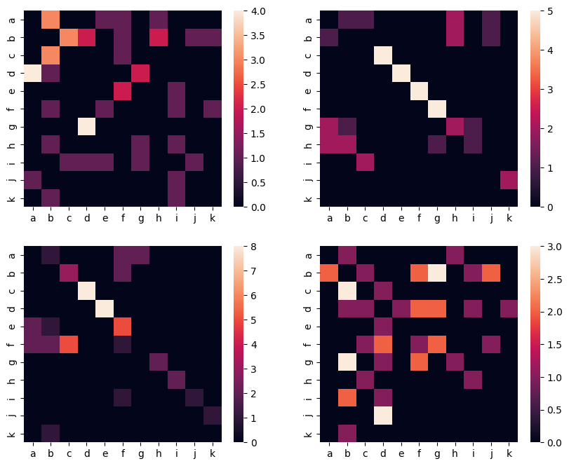

---
tags:
  - Computational
  - Puzzle
---

# Bengalese Finch Song

{/* cSpell:ignore abcbdaefbdgdabhijigdbcbhgdabkieidgdahbjaficblbfefkbcf abacdefghahbhicdefghahbhgicdefgbjklcdefgammlcdefgajkl abcdefbfcdefbfcdeaghijkbcdefafcdebcdeaghiffcdefafcdef abcdedfgfdfgbahibjdkbghcbfcbffjdcbgbidgdldbgfdibjdgba */}

Nothing to say about E1: just count the letters. $P(\text{L1}\to\text{L2})$ is the ratio of the previous two columns.

In E2, just find the letter with the highest probability that it follows _k_. The probabilities are 1/6, 1/6, 1/12, and 7/12, so the answer is _a_ with 7/12.

In E3, the problem says that Bengalese finch song is more predictable than human speech, so we want to find two strings where one letter transitions more deterministically to another. The real way to do it is of course to count all transitions. Since we are doing this in posterity anyway, I actually wrote a program to do this.

```python
from collections import Counter
import seaborn as sns
import matplotlib.pyplot as plt

def count_transitions(s):
    transitions = Counter()
    for a, b in zip(s, s[1:]):
        transitions[(a, b)] += 1
    return transitions

strings = [
    "abcbdaefbdgdabhijigdbcbhgdabkieidgdahbjaficblbfefkbcf",
    "abacdefghahbhicdefghahbhgicdefgbjklcdefgammlcdefgajkl",
    "abcdefbfcdefbfcdeaghijkbcdefafcdebcdeaghiffcdefafcdef",
    "abcdedfgfdfgbahibjdkbghcbfcbffjdcbgbidgdldbgfdibjdgba",
]

plt.figure(figsize=(10, 8))

for i, s in enumerate(strings):
    transitions = count_transitions(s)
    ax = plt.subplot(2, 2, i + 1)
    sns.heatmap(
        [[transitions[(a, b)] for b in "abcdefghijk"] for a in "abcdefghijk"],
        xticklabels="abcdefghijk",
        yticklabels="abcdefghijk",
        ax=ax
    )

plt.savefig(f"E.png", bbox_inches="tight")
```



It's obvious that sequences B and C feature fewer transitions, with most concentrated along a diagonal, while A and D have the transitions spread out more evenly across all combinations.

In the real test, it's probably impossible to enumerate all 121 transitions for 4 sequences. The next best thing is to count the number of letters each letter can be followed by. For example, for sequence A:

- _a_ → _b_, _e_, _f_, _h_
- _b_ → _c_, _d_, _f_, _h_, _j_, _k_, _l_
- _c_ → _b_, _f_
- _d_ → _a_, _b_, _g_
- _e_ → _f_, _i_
- _f_ → _b_, _e_, _i_, _k_
- _g_ → _d_
- _h_ → _b_, _g_, _i_
- _i_ → _c_, _d_, _e_, _g_, _j_
- _j_ → _a_, _i_
- _k_ → _b_, _i_
- _l_ → _b_

For sequence B:

- _a_ → _b_, _c_, _h_, _j_, _m_
- _b_ → _a_, _h_, _j_
- _c_ → _d_
- _d_ → _e_
- _e_ → _f_
- _f_ → _g_
- _g_ → _a_, _b_, _h_, _i_
- _h_ → _a_, _b_, _g_, _i_
- _i_ → _c_
- _j_ → _k_
- _k_ → _l_
- _l_ → _c_
- _m_ → _l_, _m_

It's still a really painful process (52 transitions to check for each sequence), but much easier to manage by hand, and the results are easy to visualize.

In E4, we just need to find a sequence with the matching probabilities.

- `.40` must be RE.
- After E, a `.15` transition can be either R or S. However, the next one is `.20` and R has no `.20` transition, so it must be S.
- After S, the `.20` transition must be T.
- After T, the `.05` transition can be either L or S, but S has no `.35` transition, so it must be L.
- ...

Again, very tedious to do by hand, but not a lot of thinking involved—just reuse the same way of reasoning as above.
